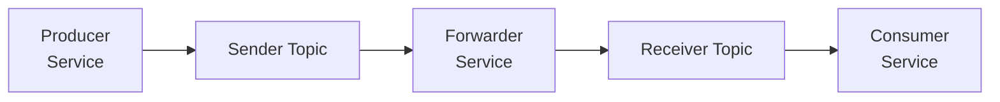

# Kafka Mock Spring Boot Application

[](https://www.oracle.com/java/)
[](https://spring.io/projects/spring-boot)
[](https://maven.apache.org/)
[](https://kafka.apache.org/)

## Description

This project demonstrates a Kafka-based messaging system implementation using Spring Boot.

## 🏗Architecture



### Message Flow

1. **Producer Service** sends messages to the `sender` topic with trace ID headers
2. **Forwarding Service** listens to `sender` topic and forwards messages to `receiver` topic
3. **Consumer Service** processes messages from `receiver` topic and stores them for verification
4. **Trace ID** is preserved throughout the entire pipeline for correlation

## Project Structure

```text
src/
├── main/
│   ├── java/com/example/kafka/
│   │   ├── Application.java                 # Main application class
│   │   ├── config/
│   │   │   └── KafkaConfig.java            # Kafka configuration
│   │   ├── model/
│   │   │   └── Message.java                # Message model
│   │   └── service/
│   │       ├── KafkaProducerService.java   # Message producer
│   │       ├── KafkaConsumerService.java   # Message consumer  
│   │       └── KafkaForwardingService.java # Message forwarder
│   └── resources/
│       └── application.properties          # Main configuration
└── test/
    ├── java/com/example/kafka/
    │   └── KafkaIntegrationTest.java       # Integration tests
    └── resources/
        └── application-test.properties     # Test configuration
```

## Getting Started

This project supports flexible configuration through application.properties files.
Both the application and tests can read from these configuration files, enabling easier local setup, CI/CD integration, and environment switching.

### Building the Project

```bash
# Clean and compile
mvn clean compile

# Run tests
mvn test

# Package the application
mvn package

# Build with all quality checks
mvn clean install
```

### Running the Application

```bash
# Start the Spring Boot application
mvn spring-boot:run

# Or run the JAR directly
java -jar target/kafka-messaging-0.0.1-SNAPSHOT.jar
```

## Testing

### Running Integration Tests

```bash
# Run all tests with embedded Kafka
mvn test

# Run specific test class
mvn test -Dtest=KafkaIntegrationTest

# Run with verbose output
mvn test -X
```

### Code Formatting and Analysis

```bash
# Apply Google Java format
mvn spotless:apply

# Check formatting
mvn spotless:check

# Run Checkstyle analysis
mvn checkstyle:check

# Generate Checkstyle report
mvn checkstyle:checkstyle
```

## Monitoring and Debugging

### Logging Levels

- `INFO`: Application startup and key business events
- `DEBUG`: Detailed message processing information
- `ERROR`: Error conditions and exceptions

```bash
# Logging Configuration
logging.level.root=INFO
logging.level.com.example.kafka=DEBUG
logging.pattern.console=%d{yyyy-MM-dd HH:mm:ss} - %msg%n
```

## Contributing

1. **Code Style**: Use formatters 
2. **Testing**: Ensure all tests pass and add tests for new features
3. **Documentation**: Update JavaDoc and README for changes
4. **Quality**: Run `mvn clean install` to ensure all quality checks pass
